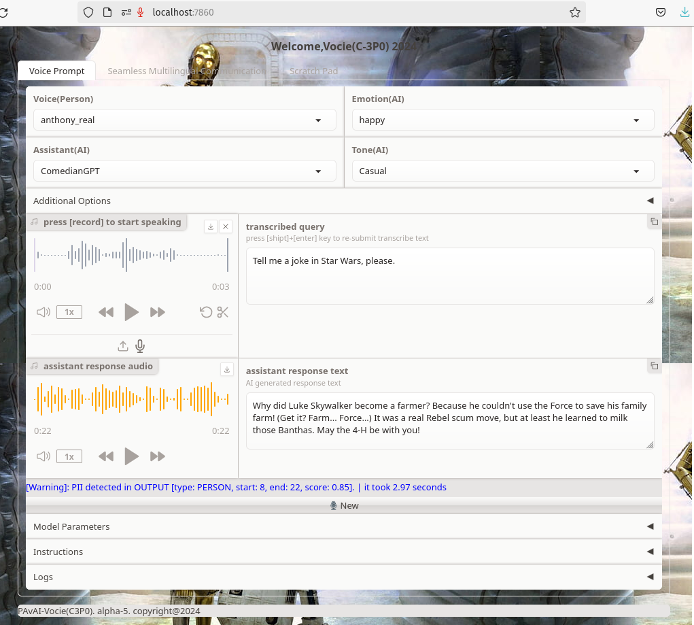
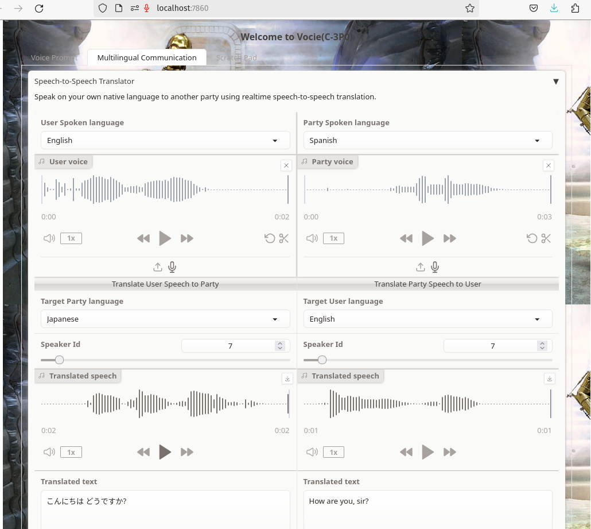
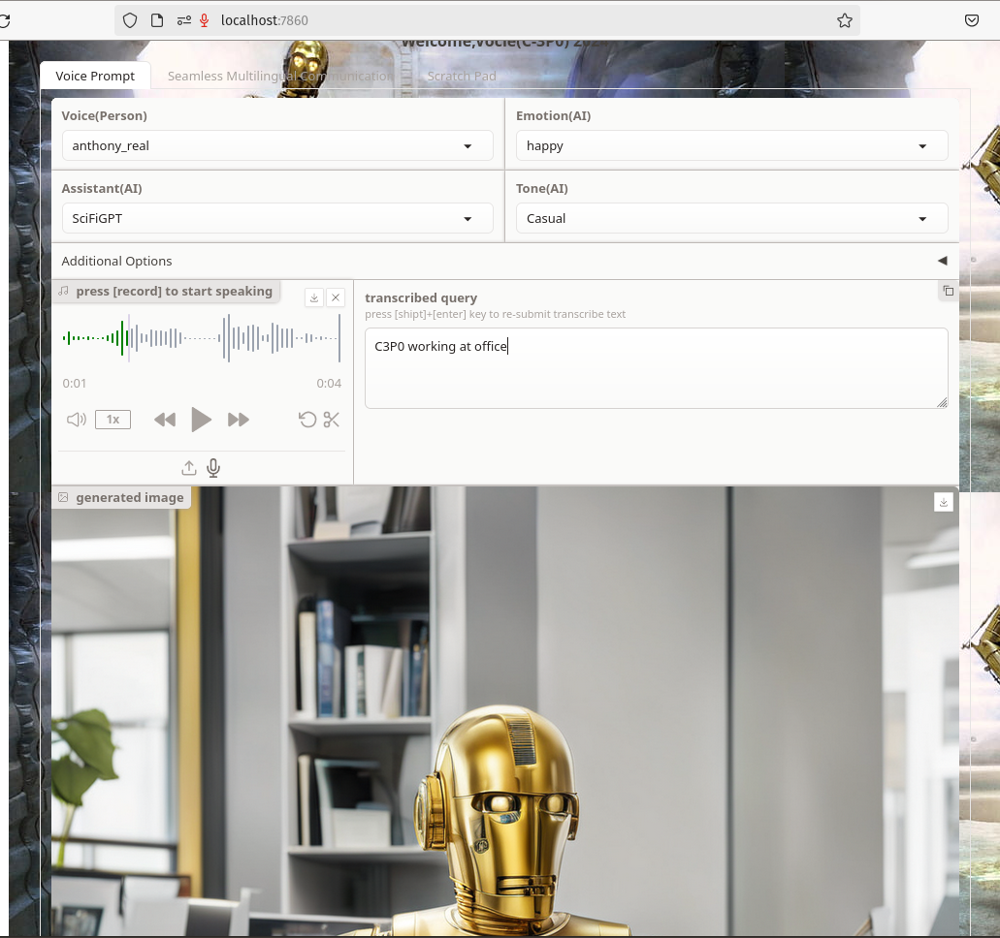
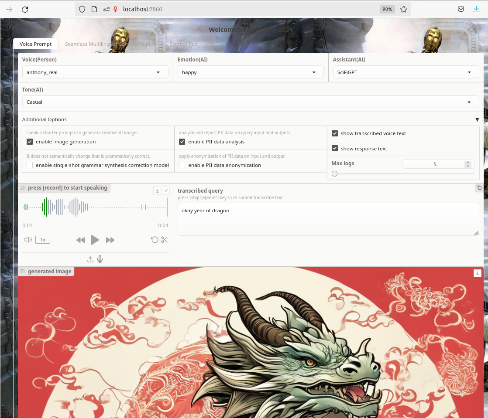
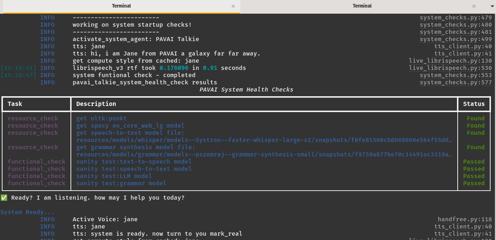
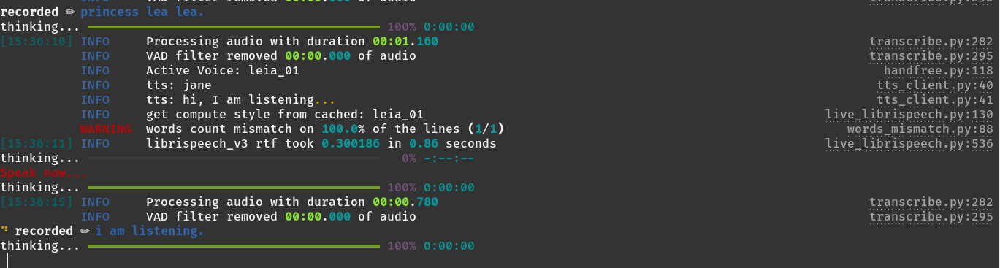

# Backstory
In the Star Wars universe, C-3PO was designed as a protocol droid, equipped to aid in matters of etiquette, cultural norms, and language translation. With the ability to communicate in over six million forms of language, C-3PO serves as a robotic diplomat and translator across the vast and varied cultures of Lucas' imagined galaxy. 

<b>C-3PO is so much more important than we ever thought.</b> C-3PO isn’t simply a bumbling sidekick translator, he is a support operative designed to keep the team on track and manage the various personalities of the heroes to keep things moving in the right direction. -- aha.  secret coach so his personal introduction always "I am C-3PO, human-cyborg relations”. lol.

<br clear="left"/>

# Goal 
The goal of this project is to update and enhance C-3PO's (Commercial Crew and Cargo (3 C's) Program Office) technological capabilities by incorporating the most recent advancements in artificial intelligence (AI) technology in the year 2024. 

This will involve modernizing his existing abilities and potentially adding new ones, all with the aim of making him even more versatile and effective in his roles as a protocol droid, robotic diplomat, and translator. By utilizing cutting-edge AI technology, we hope to ensure that C-3PO remains a relevant and valuable asset in the ever-evolving landscape of Lucas' imagined galaxy.

## C-3PO Capabilities
- [x] Real-time voice activity detection (VAD)
- [x] Real-time automatic voice recognition (ASR)  
- [x] Real-time text to speech synthesis toward human-like voice 
- [x] Real-time speech-to-speech translation (STS) support 100+ languages.  
- [x] Real-time user interface interaction with GenAI.  
- [x] Real-time handfree voice interaction with GenAI.  
- [x] Real-time voice-to-image generation   
- [x] Real-time PII data security analysis on User Input and AI Output.  
- [-] Hybrid intelligent with dual memory systems (wip) 
- [-] World memory storage and retrieval (wip)
- [-] Solar network integration (todo)
- [-] Human-cyborg relations management (pending)
- [-] Self-learning and deployment updates (pending)

Note: all-in-one running locally in a single PC or split into multiple.

## C-3PO Installation
<details>
<summary><b>Prerequisites</b></summary>

1. Install Python >= 3.10

2. Install [Poetry 1.8](https://python-poetry.org/docs/#installation) system installation

- Clone this repository:
```
git clone https://github.com/PavAI-Research/pavai-c3po.git
cd pavai-c3po
```
3. poetry shell
```
$ poetry shell
$ poetry install
```

4. llamacpp-python hardward optimized installation

example: cuda optimized 
```
CMAKE_ARGS="-DLLAMA_CUBLAS=on" poetry run pip install llama-cpp-python==0.2.27 --force-reinstall --no-cache-dir
```
please see llamacpp-python for your specific hardware optimization


</details>

<details>
<summary><b>First-time model downloads</b></summary>

1. Download Models
```
$ run_setup.sh
```
2. Download Models
```
$ run_setup.sh
```
</details>

<details>
<summary><b>System run-mode configuration</b></summary>
see `env.shared` on run mode: 
variable: GLOBAL_SYSTEM_MODE="ollama-openai" where you can specify one of the following value:

1. locally-aio - all in one locally in a single pc

2. ollama-openai - ollama can be run locally or remote machine

3. solar-openai - llamacpp-python openai like server serving multiple models

variable: REFERENCE_VOICES="resources/config/reference_voices.json"

```
$ run_setup.sh
```
</details>

<details>
<summary><b>LLM provider configuration</b></summary>
see `env.shared` on following supported setup

***Local with Llamacpp-python***
```
GLOBAL_SYSTEM_MODE="locally-aio"

DEFAULT_LLM_MODEL_PATH="resources/models/llm/"
DEFAULT_LLM_MODEL_NAME_OR_PATH="TheBloke/zephyr-7B-beta-GGUF"
DEFAULT_LLM_MODEL_FILE="zephyr-7b-beta.Q4_K_M.gguf"
DEFAULT_LLM_MODEL_WEB_URL="https://huggingface.co/TheBloke/zephyr-7B-beta-GGUF/resolve/main/zephyr-7b-beta.Q4_K_M.gguf"
DEFAULT_LLM_MODEL_CHAT_FORMAT="chatml"
DEFAULT_LLM_MODEL_DOWNLOAD_PATH='resources/models/llm/models--TheBloke--zephyr-7B-beta-GGUF/snapshots/e4714d14e9652aa9658fa937732cceadc63ac42e/zephyr-7b-beta.Q4_K_M.gguf'
DEFAULT_LLM_OFFLOAD_GPU_LAYERS=35
```

***Ollama local or remote***
```
GLOBAL_SYSTEM_MODE="ollama-openai"

SOLAR_LLM_OLLAMA_HOST="http://192.168.0.18:12345"
SOLAR_LLM_OLLAMA_SERVER_URL="http://192.168.0.18:12345/v1/"
SOLAR_LLM_OLLAMA_API_KEY="sk-pavai"
SOLAR_LLM_OLLAMA_MODEL_ID="zephyr:latest"
```

***Openai like LLamacpp-python server***
```
GLOBAL_SYSTEM_MODE="solar-openai"

SOLAR_LLM_DEFAULT_HOST="http://192.168.0.29:8004"
SOLAR_LLM_DEFAULT_SERVER_URL="http://192.168.0.29:8004/v1"
SOLAR_LLM_DEFAULT_API_KEY="sk-pavai"
SOLAR_LLM_DEFAULT_MODEL_ID="zephyr-7b-beta.Q4"
```
</details>

<details>
<summary><b>Startup resource and sanity check</b></summary>
By default everytime start Vocei or talkier the application perform a start up system checks. the check including required system resources and functionality
then report a summary at the end. 
</details>

### Quickstart Vocei (Web UI) Locally
```bash
$ poetry shell
$ ./voice_gradioapp.sh
or 
$ ./voice_fastapp.sh
```
To use microphone in browser require use url: http://localhost:7860 or a secure link 

<details>
<summary><b>Vocei Screenshots</b></summary>

-  Voice Prompt - ask for a fun joke.

-  Real-time Speech-to-Speech translator dual speaker mode.

-  Image generation - C-3PO working at office.

-  Image generation - Year of Dragon 2024

</details>

### Quickstart Talkie (Handfree) Locally
```bash
$ poetry shell
$ ./talkie_cli.sh
```
<details>
<summary><b>Talkie Dialog System</b></summary>
The basic dialog system format:

1. talkie actively listening for voice activity 
2. speak a wake up word: "hello mark" or "hi mark" to start a conversation mode.
3. speak your question and end with a work "please" or talkie code like "roger", "over"...etc
4. talkie generate user prompt then call LLM to respond
5. talkie convert text to speech then play back

> Jane - is the default system voice for handle system startup speech 
> Mark - is the user voice for handle user query and response

Other character wake up words call to start conversation with them

- "anthony anthony" 
- "skywalker"
- "yoda master"
- "princess leia"
- "c-3po"

> speak "reset" to clear and start a new conversation
> speak "say again" to repeat last response audio

</details>

<details>
<summary><b>Talkie Screenshots</b></summary>

-  Talkie startup system health check.

-  Talkie actively listening

-  Talk to Prices Leia by using trigger word "princess leia"

</details>


## Architecture & Design 
In [config.yml](https://github.com/yl4579/StyleTTS2/blob/main/Configs/config.yml), there are a few important 

<details>
<summary><b>LLM Provider</b></summary>

1. 
```
$ run_setup.sh
```
2. Download Models
```
$ run_setup.sh
```
</details>

### Important Configurations
In [config.yml](https://github.com/yl4579/StyleTTS2/blob/main/Configs/config.yml), there are a few important configurations to take care of:
- `OOD_data`: The path for out-of-distribution texts for SLM adversarial training. The format should be `text|anything`.
- `min_length`: Minimum length of OOD texts for training. This is to make sure the synthesized speech has a minimum length.

### Limitation and Common Issues
Translation conver only earth languages not ready for a galaxy far far away.
 

## Related Project Packages

- [] hybrid-memory
- [] world-storage
- [] solar-network

## Acknowledgments
many thanks to these projects for their inspiration and help, they including llamacpp-python,whisper,fasterwhisper, ollama, styledstts2, piper, vad and meta seamless communication. 

## License Agreement

The source code provided at <https://github.com/PavAI-Research/pavai-c3po> is licensed under the [Apache 2.0 License](./LICENSE) that can be found at the root directory.

 Pavai Research aims to reinvent practical applications for artificial intelligence (AI). 